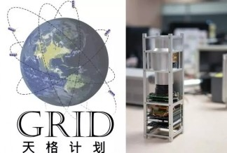
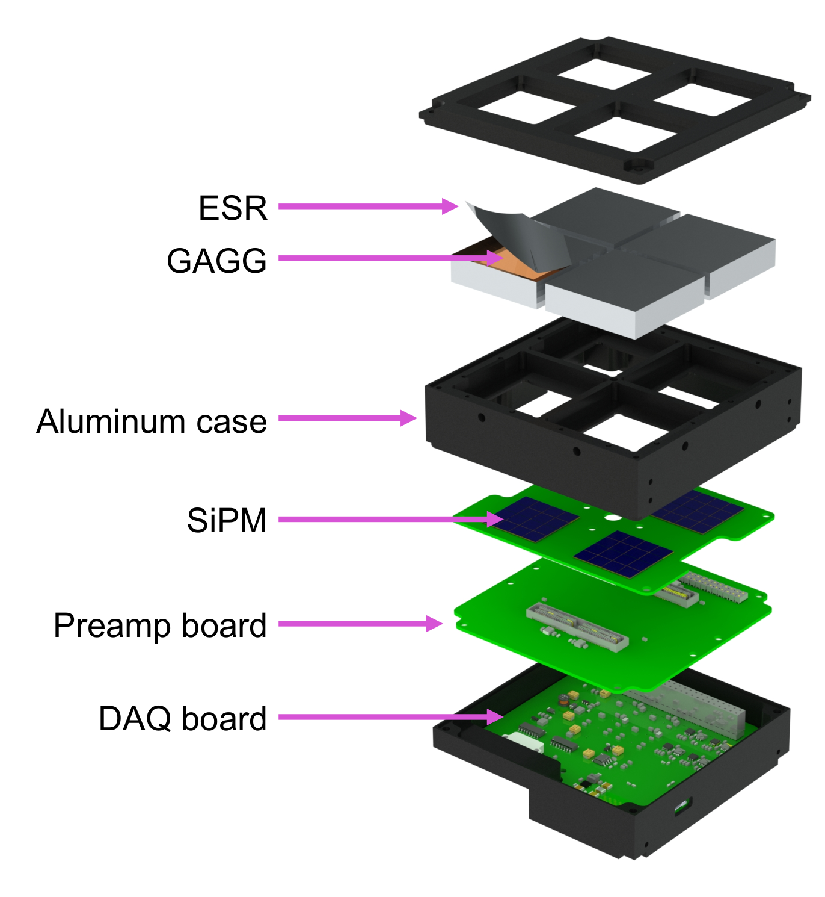
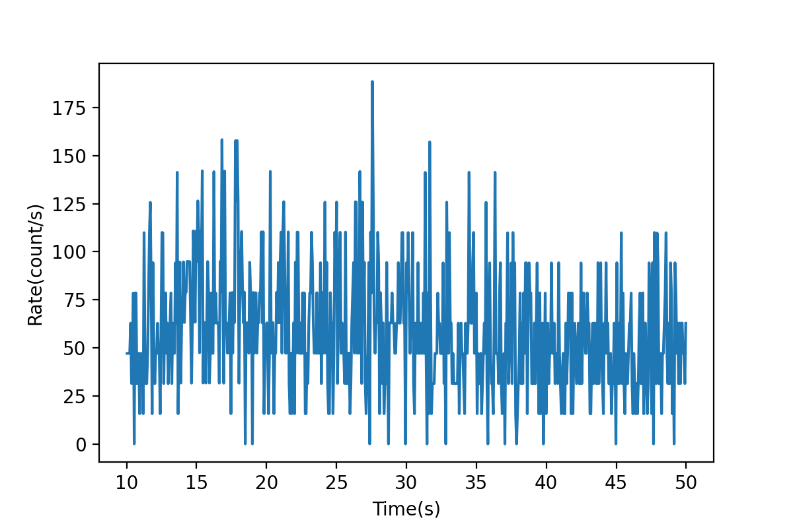

# GRID: 伽马射线暴响应模拟

提示：如果你无法渲染其中的公式，请阅读 `README.pdf`，两者内容相同.

## 问题背景

> 本次大作业设计基于"天格计划"的相关内容, 模拟伽马射线在探测器产生的能谱分布



### 伽马射线暴

伽马射线暴 (gamma-ray bursts, GRBs) 指的是天空中某一方向的伽马射线强度在短时间内突然增强, 随后又迅速减弱的现象, 持续时间从十多微秒到几个小时不等. 大多数伽马射线暴被认为来自于大质量恒星坍缩为一个中子星或黑洞的过程. 其中的一个子类短伽马射线暴(典型持续时间 0.3s)出现于两个致密天体(例如中子星或黑洞)合并事件中, 被认为是引力波在伽马射线波段的电磁对应体.

### GRID(Gamma-Ray Integrated Detectors)

GRID 将地球低轨道(500-600 km)运行的若干个立方星(CubeSats)组成监测网络, 使用搭载于其上的闪烁体探测器来监测能量为 10 keV 到 2 MeV 的短伽马射线暴.

闪烁探测器的结构如下图所示. 探测器使用晶体闪烁体(掺$\small \rm Ce\ Gd_3(Al,Ga)_5 O_{12}$, GAGG)和SiPMs来探测$\gamma$射线. 其中$\gamma$射线使闪烁体发出闪烁光子, SiPMs 利用光电效应将闪烁光子变为电子并进行倍增, 经由前置放大器输出电子学信号. ESR为增强镜面反射镜(enhanced specular reflector), 作为$\gamma$射线入射到闪烁体的窗口和闪烁体的反射层.



### Gamma 在探测器中的信号生成过程

一般闪烁体的工作原理为: 入射辐射在闪烁体内损耗并沉积能量, 引起闪烁体中原子(或离子, 分子)的电离激发, 之后受激粒子退激放出波长接近于可见光的闪烁光子. Gamma射线在闪烁体内有三种主要的能量沉积方式: 光电吸收, 康普顿散射和电子对效应. 光子的能量在光电吸收和电子对效应中被完全吸收,  而在康普顿散射中仅有部分光子能量发生沉积. 如果闪烁光子击中了SiPMs, 产生的光电子经过倍增后得到电信号, 经由前放和模数转换, 电子学信号分析处理等过程后可以得到探测器实际观测到的$\gamma$能谱.

然而, 探测器测得的能谱与入射粒子的真实能量分布并不同(与$\gamma$光子能量, 入射角度, 能量分辨率等有关), 两者可以通过一个与探测器相关的"响应矩阵"来联系:

$$
\begin{pmatrix}
E_{i1} & E_{i2} & \cdots E_{in}
\end{pmatrix}
\begin{pmatrix}
a_{11} & a_{12} & \cdots & a_{1m}\\
a_{21} & a_{22} & \cdots & a_{2m}\\
\vdots & \vdots & \ddots & \vdots\\
a_{n1} & a_{n2} & \cdots & a_{nm}
\end{pmatrix}
=\begin{pmatrix}
E_{o1} & E_{o2} & \cdots & E_{om}
\end{pmatrix}
$$


我们已经通过蒙特卡罗模拟得到了三个立方星相对源方向的响应矩阵, 保存在`matrix/Cube[num1]_[num2].rsp`中.


## 作业要求(功能部分)

本次作业尝试模拟伽马射线暴在三个立方星探测器产生的信号.

### Makefile

本次作业提供了 `Makefile`，最终助教也将使用 `Makefile` 进行测试。需要注意，你在编写所有程序文件时，都应该使用 `make` 给程序传入的参数（来自 `sys.argv`），而非硬编码下面提到的文件名；否则，你可能无法通过测试。

在本目录中运行 make -n 即可看到实际运行的命令，这或许能帮助你开发。

### 数据说明

所有的输入数据存放在`data`文件夹下，请不要轻易改动这个文件夹下的内容.
注意在评分时可能会替换这些常数, 因此你**不能直接硬编码**常数.

#### `constant.json`

包含 Gamma 射线源和三个立方星的天球坐标和轨道高度(假设三颗卫星位置固定), 地球半径. 

| 名称         | 说明                  |
| ------------ | --------------------- |
| gamma_RA     | Gamma 源赤经(h.m.s)   |
| gamma_Dec    | Gamma 源赤纬(deg)     |
| CubeSat1_RA  | 1号立方星赤经(h.m.s)  |
| CubeSat1_Dec | 1号立方星赤纬(deg)    |
| CubeSat2_RA  | 2号立方星赤经(h.m.s)  |
| CubeSat2_Dec | 2号立方星赤纬(deg)    |
| CubeSat3_RA  | 3号立方星赤经(h.m.s)  |
| CubeSat3_Dec | 3号立方星赤纬(deg)    |
| altitude_1   | 1号立方星轨道高度(km) |
| altitude_2   | 2号立方星轨道高度(km) |
| altitude_3   | 3号立方星轨道高度(km) |
| radius_earth | 地球半径(km)          |
| mu | 本底期望值(count/s)|
| sigma | 本底标准差(count/s)|


#### `source.h5`

该文件中有3个表格:

- "Energy": 100个能道的上下边界值(长度为101), 单位为 keV.

    |     | Energy  |
    | -   | ------- |
    | 0   | 4.52515 |
    | 1   | 4.80936 |
    | 2   | 5.11141 |
    | $\vdots$ | $\vdots$ |
    | 19  | 14.3966 |
    | 20  | 15.3007 |
    | $\vdots$ | $\vdots$ |
    | 99 | 1881.81 |
    | 100 | 2000.00 |

- "Time": 光变曲线(Gamma 光子计数率 vs 时间) 的时间轴(长度为625), 单位为 s. 本文件中所有光变曲线的时间轴相同.

    |     | Time  |
    | -   | ------- |
    | 0   | 10.0324 |
    | 1   | 10.0964 |
    | 2   | 10.1604 |
    | $\vdots$ | $\vdots$ |
    | 623 | 49.9044 |
    | 624 | 49.9684 |
    
- "Rate": 光变曲线的计数率(size: 100x625), 单位为 count/s. 每一行代表一个能道的光变曲线, 能道编号`i`与 "Energy" 中的能量边界值编号 `i`和`i+1` 对应.

    |          |   $t_1$  |   $t_2$  |   $t_3$  | $\cdots$ |$t_{624}$ | $t_{625}$  |
    | -        | -------  | -------  | -------  | -------  |- | -------  |
    | 0        | 0  | 0  | 0  | $\cdots$ | 15.7108  | 0 | 
    | $\vdots$ | $\vdots$ | $\vdots$ | $\vdots$ | $\ddots$ | $\vdots$ | $\vdots$ |
    | 19       | 47.1033  | 47.0907  | 47.1190  | $\cdots$ |31.4216 | 62.75  |
    | $\vdots$ | $\vdots$ | $\vdots$ | $\vdots$ | $\ddots$ |$\vdots$ | $\vdots$ |
    | 99       | 172.712  | 125.575  | 157.063  | $\cdots$ | 157.108 | 94.125  |

    例如, 能道14.4\~15.3keV的光变曲线在"Energy"中的编号为19和20, 对应在 "Rate" 中的行号为19, 其曲线如下图所示:



#### `matrix/Cube[num1]_[num2].rsp`

对应在探测器`[num1]`上的第`[num2]`个晶体上的响应矩阵(`[num1]`的取值范围1\~3, 对应三颗立方星; `[num2]`取值范围0\~3, 对应每个探测器上的四块闪烁晶体).

##### `.rsp`文件说明

`.rsp`文件的读取可以用`astropy.io`的`fits.open()`方法, 返回值为`HDUList`类型. 使用`HDUList.info()`查看文件中的内容:

```python
>>> file1 = fits.open("Cube1_det0.rsp")
>>> file1.info()
Filename: Cube1_det0.rsp
No.    Name      Ver    Type      Cards   Dimensions   Format
  0  PRIMARY       1 PrimaryHDU       4   ()      
  1  EBOUNDS       1 BinTableHDU     24   200R x 3C   [I, E, E]   
  2  SPECRESP MATRIX    1 BinTableHDU     31   100R x 6C   [E, E, I, I, I, 200E]
```
其中 `EBOUNDS` 里保存了输出能谱(探测器能谱)的200个能道:

```python
>>> ebounds = file1["EBOUNDS"]
>>> ebounds.data
FITS_rec([(  1,    4.       ,    4.1262436),
          (  2,    4.1262436,    4.256471 ),
          (  3,    4.256471 ,    4.390809 ),
          (  4,    4.390809 ,    4.5293865),
          (  5,    4.5293865,    4.672338 ),
          ...
          (193, 1559.8082   , 1609.0371   ),
          (194, 1609.0371   , 1659.8196   ),
          (195, 1659.8196   , 1712.205    ),
          (196, 1712.205    , 1766.2435   ),
          (197, 1766.2435   , 1821.9877   ),
          (198, 1821.9877   , 1879.4912   ),
          (199, 1879.4912   , 1938.8096   ),
          (200, 1938.8096   , 2000.       )],
         dtype=(numpy.record, [('CHANNEL', '>i2'), ('E_MIN', '>f4'), ('E_MAX', '>f4')]))
```

在`SPECRESP MATRIX`的每一行(100行, 对应100个能道)中, 前两个数字为输入能谱(原始能谱, 100个能道)能道的能量上下限, 最后一个长度为200的列表为对应能量区间的能谱.

```python
>>> specresp_matrix = file1["SPECRESP MATRIX"]
>>> specresp_matrix.data[0]
(4.0, 4.256471, 1, 1, 200, array([3.17280516e-02, 3.27409171e-02, 3.37614603e-02, 3.47859524e-02,
       3.58101390e-02, 3.68291959e-02, 3.78376804e-02, 3.88295166e-02,
       3.97979803e-02, 4.07356545e-02, 4.16344218e-02, 4.24854979e-02,
       4.32794057e-02, 4.40060422e-02, 4.46547158e-02, 4.52142470e-02,
       4.56730537e-02, 4.60193045e-02, 4.62411009e-02, 4.63266559e-02,
       4.62645814e-02, 4.60441448e-02, 4.56556007e-02, 4.50905450e-02,
       4.43423018e-02, 4.34063002e-02, 4.22804914e-02, 4.09657322e-02,
       3.94661501e-02, 3.77894305e-02, 3.59470621e-02, 3.39544490e-02,
       3.18308994e-02, 2.95994636e-02, 2.72865947e-02, 2.49216203e-02,
       2.25360300e-02, 2.01625917e-02, 1.78343020e-02, 1.55832460e-02,
       1.34393955e-02, 1.14294356e-02, 9.57568455e-03, 7.89520983e-03,
       6.39919331e-03, 5.09262225e-03, 3.97434551e-03, 3.03748972e-03,
       2.27021961e-03, 1.65677199e-03, 1.17867498e-03, 8.16037238e-04,
       5.48794575e-04, 3.57799960e-04, 2.25679803e-04, 1.37403928e-04,
       8.05616946e-05, 4.53715293e-05, 2.44790499e-05, 1.26158775e-05,
       6.19194589e-06, 2.88478191e-06, 1.27137514e-06, 5.28094063e-07,
       2.05932608e-07, 7.50767484e-08, 2.54757317e-08, 8.00829003e-09,
       2.32041164e-09, 6.16429463e-10, 1.49289109e-10, 3.27623068e-11,
       6.47308943e-12, 1.14395212e-12, 1.79469165e-13, 2.46263394e-14,
       3.03605746e-15, 3.37393711e-16, 0.00000000e+00, 0.00000000e+00,
       0.00000000e+00, 0.00000000e+00, 0.00000000e+00, 0.00000000e+00,
       0.00000000e+00, 0.00000000e+00, 0.00000000e+00, 0.00000000e+00,
       0.00000000e+00, 0.00000000e+00, 0.00000000e+00, 0.00000000e+00,
       0.00000000e+00, 0.00000000e+00, 0.00000000e+00, 0.00000000e+00,
       ...
       0.00000000e+00, 0.00000000e+00, 0.00000000e+00, 0.00000000e+00,
       0.00000000e+00, 0.00000000e+00, 0.00000000e+00, 0.00000000e+00,
       0.00000000e+00, 0.00000000e+00, 0.00000000e+00, 0.00000000e+00],
      dtype=float32))
```

`astropy.io.fits`文档见[FITS File Handling](https://docs.astropy.org/en/stable/io/fits/index.html).

### 基本要求

作业功能部分（占80分）的基础要求为模拟高能$\gamma$光子在探测器中的响应,
分成以下几部分，完成各个任务即可拿到相应分数：

| 任务（程序名）             | 分数 |
| ----------------------- | ---- |
| `energy_spectrum.py`    | 20   |
| `source_generate.py`    | 15   |
| `calculate_response.py` | 30   |
| `plot_signal.py`        | 15   |

#### `energy_spectrum.py`

根据 `source.h5` 中的数据, 作出$\gamma$光子的能谱, 横轴为能量(keV), 纵轴为单位能量的计数率(count/s-keV). 将结果保存为`sepctrum.png`.


#### `source_generate.py`

将$\gamma$光子和本底计数率相加, 得到进入探测器的伽马射线的光变曲线(计数率 versus 时间).
假设每个能道的X射线本底均匀, 对任意时刻的计数率服从分布$N(\mu, \sigma^2)$.

输出结果为光变曲线`light_curve.png`和数据文件`light_curve.h5`(格式与 `source.h5` 相同).
其中`light_curve.png` 中需要绘制出能量范围0\~100keV, 100\~200keV和200\~300keV内的光变曲线, 并在图例中标注能量范围.


####  `calculate_response.py`

伽马暴源的位置距离地球很远, 因此可将$\gamma$射线视为从源方向平行到达地球.
根据 `constant.json` 中的位置信息和探测器响应`Cube[num1]_[num2].rsp`, 
以及上一步得到的`light_curve.h5`, 求出在三个立方星上晶体的响应能谱.
注意需要根据Gamma源和卫星位置判断是否能够接收到信号(仅考虑地球的遮挡), 以及信号的时序关系. 
将该段时间内的总响应能谱保存到`energy_response.h5`中, 并在报告中详细说明该H5文件中的数据组织结构.

#### `plot_signal.py`

根据上一步的响应计算结果, 在同一张图中绘制出探测器响应能谱随时间的变化, 使用 GIF 动画展示, 输出文件保存为 `energy_response.gif`. 注意在图中注明必要的信息.


### 提高要求

提高要求为加分项，至多可加 10 分. 你可以自由发挥, 例如:

1. 给出具有某一姿态(四元数)的立方星对某一天球方位Gamma源的响应矩阵
2. 从探测器基本原理出发, 提出计算探测器响应的其他模型, 并予以必要推导和代码实现

提高部分的内容不仅仅局限于以上内容, 你可以对某个具体的物理过程自由发挥. 如果你实现了任何提高要求, 请在实验报告中详细说明你的工作, 这将作为评分的依据.


## 作业要求(非功能部分)

非功能部分的要求详见大作业公告, 此部分占20分.


## 参考文献

1. Wikipedia contributors. "Gamma-ray burst." Wikipedia, The Free Encyclopedia. Wikipedia, The Free Encyclopedia, 5 Jul. 2021. Web. 31 Jul. 2021. 
2. Jiaxing Wen, Xiangyun Long, Xutao Zheng, Yu An, Zhengyang Cai, Jirong Cang, Yuepeng Che,Changyu Chen, Liangjun Chen, Qianjun Chen, and et al. Grid: a student project to monitor the transient gamma-ray sky in the multimessenger astronomy era. *Experimental Astronomy*, 48(1):77–95, Aug 2019.
3. 陈伯显. 核辐射物理及探测学[M]. 哈尔滨: 哈尔滨工程大学, 2011.

